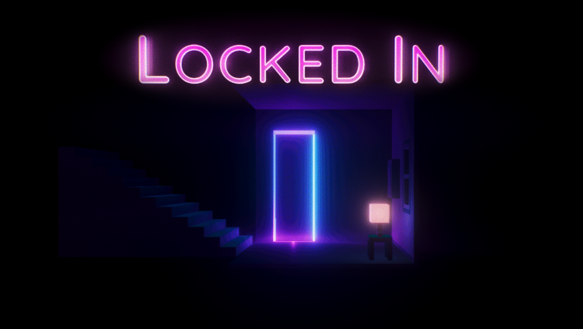

# Locked In
**a brief first-person adventure**
*someone behind a mysterious door is asking you for help*

## Credits
*Locked In* was created by Benji Kay as an exercise in learning Unity. It uses the following free resources:

#### Scripts
* [First Person Drifter](http://www.torahhorse.com/index.php/portfolio/first-person-drifter-for-unity/) by Ben Esposito
* [V-Light Volumetric Lights](https://assetstore.unity.com/packages/tools/particles-effects/v-light-volumetric-lights-2037) by Brian Su
* [Outline Effect](https://assetstore.unity.com/packages/vfx/shaders/fullscreen-camera-effects/outline-effect-78608) by Cakeslice
* [TextMeshPro](https://assetstore.unity.com/packages/essentials/beta-projects/textmesh-pro-84126) by Unity Technologies

##### (WARNING: SPOILERS AHEAD)

#### Skyboxes
* [3 Skyboxes 2](https://assetstore.unity.com/packages/2d/textures-materials/sky/3-skyboxes-2-25582) by Bright Shining Star

#### Models
* [Humpback Whale](https://assetstore.unity.com/packages/3d/characters/animals/humpback-whale-3547) by Janpec
* [3D Monster 0002 : Shell Crab](https://assetstore.unity.com/packages/3d/characters/creatures/3d-monster-0002-shell-crab-53706) by Layer Lab
* [Skeleton - PBR - Animated - Low Poly](https://assetstore.unity.com/packages/3d/characters/humanoids/skeleton-pbr-animated-low-poly-30659) by Lugia Games
